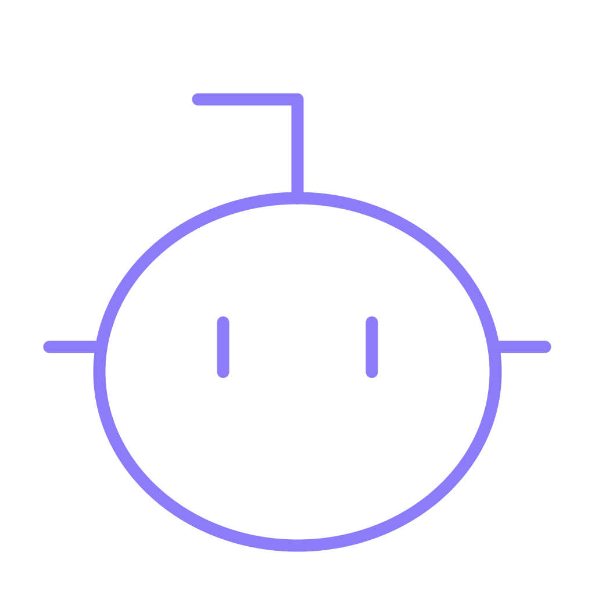
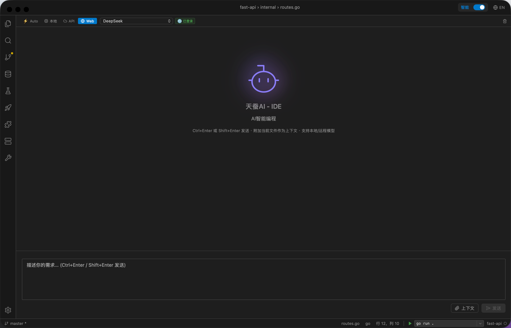
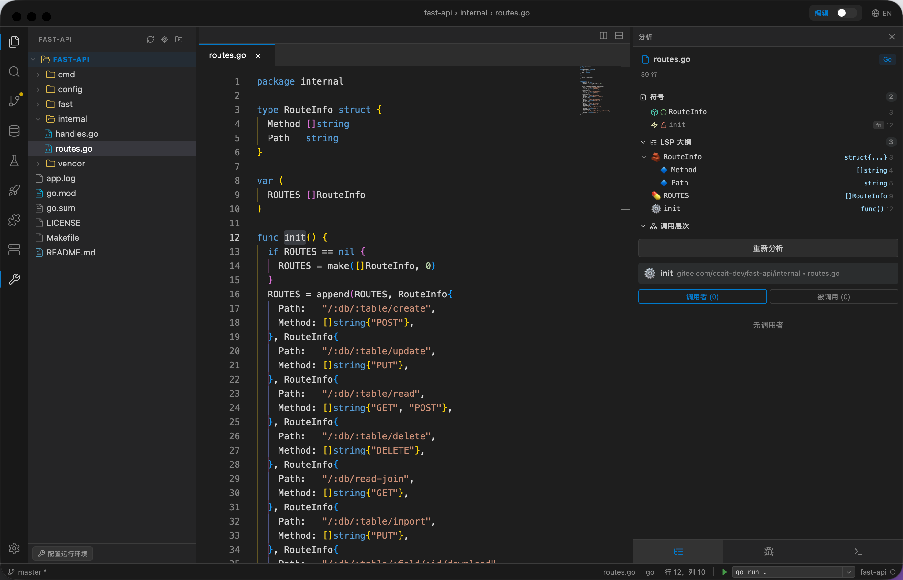

<div align="center">
  
  <h1>天蚕 · TianCan AI IDE</h1>
  <p>纯本地、跨平台（Windows / macOS / Linux）的 AI 编程 IDE<br/>
  无需云端 API，无需订阅，所有 AI 推理均在本地硬件运行，数据零上传</p>
  <p>
    <a href="https://github.com/linlurui/TianCan-AI-IDE">GitHub 仓库</a>
  </p>
</div>

---

## 界面预览

<div align="center">
  
  
</div>

---

## 特性总览

| | |
|---|---|
| 🧠 **AI 智能体** | Think→Act→Observe 闭环，40+ 工具，自动规划与执行多步任务 |
| 🔒 **安全沙箱** | 进程级隔离 + 容器级沙箱，高危操作强制人工确认 |
| 🖥️ **本地推理** | 支持 LM Studio / OpenAI 兼容 API |
| 📝 **代码编辑** | Monaco Editor + 多语言 LSP + Diff 审查 |
| 🔧 **断点调试** | DAP 协议，支持 Go / Python / JS / C++ / Java / Dart 等 6+ 语言 |
| 📂 **Git 集成** | 提交、分支、Diff 查看、历史回溯 |
| 🌐 **Web AI 接入** | 支持通过浏览器接入 DeepSeek / ChatGPT 等 Web AI，无需本地模型 |
| 🔌 **MCP 协议** | 完整 MCP Client/Server，动态扩展工具与上下文 |
| 🧪 **自我验证** | 自动生成测试 + 完成度评估，不通过则自动修复 |

---

## 核心特性

### AI 智能体

天蚕的 AI Agent 采用 **TAOR（Think → Act → Observe → Repeat）** 主循环，能自主完成复杂编程任务：

- **自动规划**：分析用户意图，分解为可执行步骤
- **工具调用**：40+ 内置工具（文件读写、终端执行、代码搜索、LSP 查询、Git 操作、数据库、API 测试等）
- **自纠错循环**：执行后自动验证，失败则自动修复
- **意图澄清**：指令模糊时主动提问，避免误操作
- **双模式切换**：询问模式（逐步确认）与自动模式（授权范围内自主执行）
- **子Agent并行**：复杂任务可派生子 Agent 并行处理
- **技能系统**：可复用的标准化工作流（`.skill.yaml`），支持社区共享

### 安全与审查

- **进程级沙箱**：独立进程组 + 资源限制（内存/CPU/超时）+ 路径白名单
- **容器级沙箱**：集成 Daytona / Docker，容器级隔离执行
- **Diff 审查**：AI 修改文件前展示 Monaco Diff 视图，接受/拒绝/编辑后接受
- **高危确认**：删除文件、`rm -rf`、网络请求等操作强制弹框确认
- **操作审计**：所有 AI 操作记录日志，支持基于 Git 快照一键回滚


### Web AI 接入

无需本地 GPU，通过浏览器接入 Web AI 服务（DeepSeek、ChatGPT 等），Agent 同样可以调用工具、执行命令、读写文件，实现零门槛上手。

---

## 技术栈

| 层次 | 技术 |
|------|------|
| 桌面框架 | [Wails v3](https://v3.wails.io/)（Go）— 多窗口架构，原生 WebView |
| 前端 | React + TypeScript + [Monaco Editor](https://microsoft.github.io/monaco-editor/) + xterm.js |
| 代码智能 | LSP（Language Server Protocol）+ monaco-languageclient |
| 调试 | DAP（Debug Adapter Protocol）+ go-dap |
| 版本控制 | go-git — 纯 Go Git 客户端 |
| AI 推理 | LM Studio / OpenAI 兼容 API / Web AI Provider |
| 模型路由 | Smart Router（LLM 意图分类 + 资源感知调度） |
| 扩展协议 | MCP（Model Context Protocol）— Client + Server |
| 沙箱 | 进程级隔离（setrlimit）+ 容器级（Daytona / Docker） |

---

## 项目结构

```
TianCan-AI-IDE/
├── frontend/              # React + Monaco + xterm.js
│   └── src/components/    # 编辑器 / 终端 / AI 面板 / 调试 / Git 等 UI 组件
├── backend/
│   ├── agent/             # AI Agent 核心（TAOR 循环 / 工具 / 路由 / 记忆 / 安全）
│   ├── ai/                # AI 服务层（LM Studio / Web AI / 流式解析）
│   ├── webai/             # Web AI Provider 解析器（工具调用提取 / SSE 解析）
│   ├── lsp/               # LSP 客户端
│   ├── debug/             # DAP 调试适配
│   ├── git/               # go-git 集成
│   ├── sandbox/           # 沙箱（Daytona / Docker fallback）
│   ├── database/          # 数据库管理
│   ├── deploy/            # 部署工具
│   ├── remote/            # SSH 远程开发
│   ├── router/            # Smart Router
│   ├── skills/            # 技能系统
│   ├── extension/         # 扩展市场
│   └── terminal/          # PTY 终端管理
├── main.go                # Wails 入口
├── config.yml             # 运行配置
└── .github/workflows/    # CI/CD（多平台构建）
```

---

## 快速开始

### 环境依赖

| 工具 | 版本 | 安装 |
|------|------|------|
| Go | ≥ 1.25 | https://go.dev/dl/ |
| Node.js | ≥ 20 LTS | https://nodejs.org/ |
| Wails CLI v3 | alpha.74+ | `go install github.com/wailsapp/wails/v3/cmd/wails3@latest` |

### 开发模式

```bash
git clone https://github.com/linlurui/TianCan-AI-IDE.git
cd TianCan-AI-IDE

# 安装依赖
go mod tidy
cd frontend && npm install && cd ..

# 生成绑定
~/go/bin/wails3 generate bindings -ts -b -names ./...

# 启动（两个终端）
# 终端 1：前端 dev server
cd frontend && npm run dev

# 终端 2：Go 后端
cp config.yml build/config.yml
go build -o build/tiancan-ai-ide .
FRONTEND_DEVSERVER_URL=http://localhost:34115 ./build/tiancan-ai-ide
```

或一键启动：`~/go/bin/wails3 dev`

### 生产构建

```bash
cd frontend && npm run build && cd ..
go build -tags production -o tiancan-ai-ide .
```

---

## 功能状态

### ✅ 已完成

- Monaco Editor 集成（语法高亮、多光标、代码折叠、Diff Editor）
- 多语言 LSP（补全、定义跳转、引用、悬停、诊断、大纲、调用层级）
- 完整 PTY 终端（go-pty + xterm.js + WebSocket）
- 多语言断点调试（Go / Python / JS / C++ / Java / Dart，DAP 协议）
- Git 版本控制（提交、分支、Diff、历史、Stage/Unstage）
- AI Agent TAOR 主循环 + RalphLoop 自纠错
- 40+ 工具集（文件/搜索/LSP/Git/测试/DB/API/部署/沙箱）
- TaskClassifier 意图分类 + 10 角色自动路由
- Smart Router 基础框架（任务分类 + 失败降级）
- MCP Client/Server（Resources / Tools / Prompts）
- Web AI Provider（DeepSeek / ChatGPT 等浏览器接入）
- 进程级沙箱 + 容器级沙箱（Daytona / Docker）
- Human Review（Diff 审查 + 高危操作确认）
- AI 自我验证（generate_tests + assess_completion）
- 配置系统（TIANCAN.md + @include + 规则目录）
- 记忆系统（MemoryStore + ContextWindow + AdvancedCompactor）
- 并行执行（DAGExecutor + ResultAggregator）
- 回滚管理（RollbackManager）
- 技能系统（Skill Manager + `.skill.yaml`）
- 数据库管理（SQLite / MySQL / PostgreSQL）
- API 测试面板
- 远程 SSH 开发
- Docker 管理
- 代码分析面板
- 扩展市场
- 项目向导 / 导入向导
- LSP 安装引导
- 全局设置（模型 / LSP / 主题 / 快捷键）
- CI/CD（GitHub Actions 多平台构建）
- Playwright 测试集成
- 部署工具（SSH/SCP 上传）
- 运行环境自动检测 + 多配置切换
- 全局搜索面板

### 🚧 进行中 / 规划中

- Smart Router 硬件感知模型分发 + 资源监控自动降级/升级（当前仅有任务分类 + 失败降级，缺少硬件检测、gopsutil 负载感知、AI 驱动分类）
- AutoResearch 完整闭环（当前仅有 benchmark 循环骨架，缺少 AI 驱动代码修改、假设生成、多源研究、pprof 分析）
- WebSearchTool 全搜索结果（当前仅 DuckDuckGo 即时答案，缺完整搜索、分页排序）
- 子 Agent 层级编排（多级派生与结果聚合、worktree 隔离、配置驱动 Agent 定义）
- 技能市场（社区技能导入/导出/共享、技能验证沙箱、技能依赖解析）
- 容器沙箱 E2B 集成 + 沙箱 Provider 抽象层（Daytona / Docker / E2B 可选）
- 多窗口独立面板（编辑器 / 终端 / AI / 调试各自独立窗口）
- 团队协作功能

---

## 参与贡献

1. Fork 本仓库
2. 新建 `feat/xxx` 分支
3. 提交代码，保持 commit message 清晰
4. 发起 Pull Request，描述变更内容

---

## License

[Apache 2.0 License](LICENSE)
